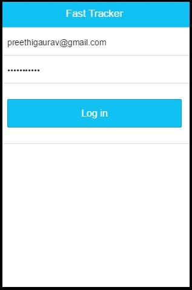
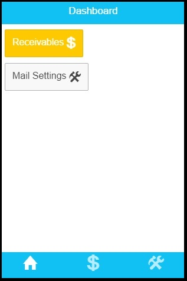
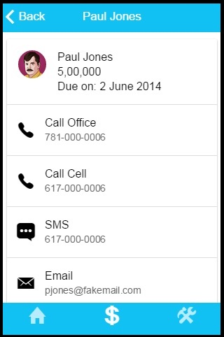
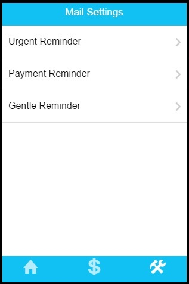

Fast Tracker
=============
This is a Hybrid Application which helps the users of Small/Medium Business Units to easily keep track of Receivables. 
It lets the user contact the Debtors using various channels - such as e-mails, SMS, phone directly from the application.
The settings of these channels can be configured in the application. The reminders can be categorized into Urgent, Gentle etc. and custom messages can be configured in the application. The list of Debtors can be searched through and the user can view complete details of a specific Debtor.

This version of Fast Tracker is built with [Ionic](http://ionicframework.com/) and [Node.js]().

 

  

 


 

It is a Hybrid Application
============================

Unlike typical mobile applications which are platform specific - iOS, Andriod etc. Hybrid Apps are built on HTML5 and Javascript which runs in the mobile phone's browser container.
It can also run as a normal web application on a machine's browser!

Advantage
==========

It runs everywhere without any issues, need not build one app per platform !

Accessing Native Resources
===========================
This is acheived using Cordova Plugins - to send SMS, email etc.

Performance
=============
Fast Tracker uses Ionic built on top of AngularJS. It is as fast and as good as Native Apps. 

Architecture
=============
As it is built on Ionic/Angular uses - MV* patterns on the UI, uses REST services to fetch data from DB.

Testing the application
========================
You can test the application in your browser:
- Using the hosted version
- By running the application's Node.js server locally
- By deploying the application's Node.js server on Heroku

You can also run the application as a hybrid app in Cordova.

Deployed Application/ Hosted Version
=====================================
Click [here](https://fastracker.herokuapp.com) to run the hosted version in your browser.

## Running the Node.js Server Locally

1. Make sure you have an up-to-date version of Node.js installed on your system. If you don't have Node.js installed, you can install it from [here](http://nodejs.org/).

1. Clone this repository

1. On the command line, navigate (cd) to the **SMB** folder

1. Install the server dependencies

  ```
  npm install
  ```

1. Start the server

  ```
  node server
  ```

1. Open a browser and access: [http://localhost:5000](http://localhost:5000)

## Deploying the Node.js Server to Heroku

Click the "Deploy to Heroku" button to deploy the application to your own Heroku instance.
[](https://heroku.com/deploy)

## Running in Cordova

### Step 1: Install Ionic

1. Make sure you have an up-to-date version of Node.js installed on your system. If you don't have Node.js installed, you can install it from [here](http://nodejs.org/).

1. Open a terminal window (Mac) or a command window (Windows), and install Cordova and Ionic:

  ```
  npm install -g cordova ionic
  ```

  On a Mac, you may have to use **sudo** depending on your system configuration:

  ```
  sudo npm install -g cordova ionic
  ```

1. If you already have Cordova and Ionic installed on your computer, make sure you update to the latest version:

  ```
  npm update -g cordova ionic
  ```

  or

  ```
  sudo npm update -g cordova ionic
  ```

### Step 2: Create the application

1. Using the Ionic CLI, create an application named **fast-tracker**:

  ```
  ionic start fast-tracker
  ```

1. Delete the default ***www*** folder in the ***fast-tracker*** folder that was just created

1. Copy the ***www*** folder from this repository to the Ionic project's ***fast-tracker*** folder


### Step 3: Building for iOS

> You need the iOS SDK installed on your computer to build an iOS version of your application
using the steps below.

1. On the command line, make sure you are in the **fast-tracker** folder

1. Add support for the iOS platform:

    ```
    ionic platform add ios
    ```

1. Build the project:

    ```
    ionic build ios
    ```

1. Open **fast-tracker.xcodeproj** in the **fast-tracker/platforms/ios** folder

1. In Xcode, run the application on a device connected to your computer or in the iOS emulator


### Step 4: Building for Android

> You need the Android SDK installed on your computer to build an Android version of your
application using the steps below.

1. Make sure the Android SDK and the ant build tool are available on your system. The Android SDK is available [here](http://developer.android.com/sdk/index.html). **Both the android and ant tools must be available in your path**. To test your configuration, you should be able to execute both **android** and **ant** from the command line.

1. On the command line, make sure you are in the **fast-tracker** folder

1. Add support for the Android platform:

    ```
    ionic platform add android
    ```

1. Build the project:

    ```
    ionic build android
    ```

    The project is built in the **fast-tracker/platforms/android** folder


1. To build and run the application on an Android device connected to your computer using a USB cable:

    ```
    ionic run android
    ```

1. To build and run the application in the Android emulator:

    ```
    ionic emulate android
    ```


